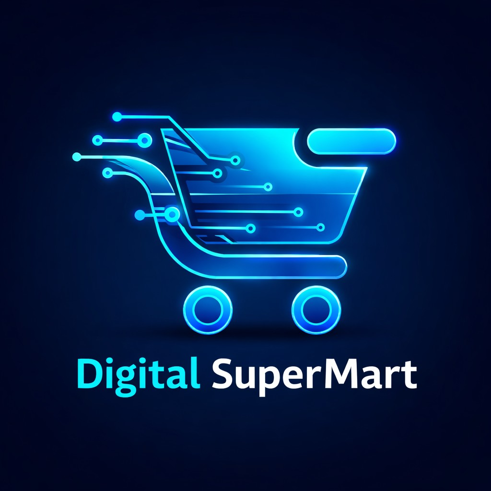

# 🛒 Digital Mart | Modern E-Commerce Platform



<p align="center">
  
  
  
  
</p>

## ✨ Overview
**Digital Mart** (Internal codename: *Night Store*) is a sleek, high-performance digital store web application built using the modern React ecosystem. Offering an immersive, fast, and beautiful user experience, the application comes with built-in animations, drag-and-drop interactions, and a comprehensive admin backend powered by Firebase.

Whether you're browsing the latest digital goods (or books!) or managing your inventory via the secure admin dashboard, Digital Mart brings an unparalleled level of polish and speed.

---

## 🚀 Key Features

- **Storefront Experience:** Beautifully animated home and product detail pages (`Framer Motion`).
- **Secure Admin Panel:** Protected administrative dashboard to manage content seamlessly. Includes a secret entry and robust authentication.
- **Rich Text Editing:** Allows administrators to create engaging product descriptions directly via `react-quill`.
- **Drag & Drop Interactions:** Intuitive UI/UX powered by `@dnd-kit` for seamless sorting and organizing.
- **Serverless Backend:** Built completely on Firebase, allowing for real-time database updates and robust storage.
- **Modern Routing:** Seamless client-side transitions using `react-router-dom`.
- **SEO & Metadata Ready:** Automated head management using `react-helmet-async`.
- **Sanitized Outputs:** Fully guarded against XSS via `dompurify` for safe HTML rendering.

---

## 🛠️ Tech Stack

### Core Frontend
- **Framework & Build:** React 18 & Vite
- **Routing:** React Router v6
- **Animations:** Framer Motion
- **Icons:** Lucide React

### Backend Services
- **BaaS:** Firebase (Database, Auth, Storage)

### Utilities & UI Capabilities
- **Drag & Drop:** `@dnd-kit/core`, `sortable`, and `utilities`
- **Rich Text:** `react-quill`
- **Toast Notifications:** `sonner`
- **Date Formatting:** `date-fns`
- **Security:** `dompurify`

---

## 📦 Installation & Setup

1. **Clone the Repository**
   ```bash
   git clone https://github.com/mrhidden313/digital_mart.git
   cd digital_mart
   ```

2. **Install Dependencies**
   It's recommended to use `npm` to install all packages.
   ```bash
   npm install
   ```

3. **Configure Environment Variables**
   Create a `.env` file in the root directory and add your Firebase configurations:
   ```env
   VITE_FIREBASE_API_KEY=your_api_key
   VITE_FIREBASE_AUTH_DOMAIN=your_auth_domain
   VITE_FIREBASE_PROJECT_ID=your_project_id
   VITE_FIREBASE_STORAGE_BUCKET=your_storage_bucket
   VITE_FIREBASE_MESSAGING_SENDER_ID=your_sender_id
   VITE_FIREBASE_APP_ID=your_app_id
   ```

4. **Run the Development Server**
   Start the Vite server with HMR.
   ```bash
   npm run dev
   ```
   Open your browser and navigate to `http://localhost:5173`.

---

## 📂 Project Architecture

```
📦 src
 ┣ 📂 components     # Reusable UI components & layouts
 ┣ 📂 context        # Global React Context providers
 ┣ 📂 pages          # Route-level components (Home, AdminDashboard, BookDetail, etc.)
 ┣ 📂 services       # Firebase configs, API calls, and backend handlers
 ┣ 📜 App.jsx        # Root component
 ┣ 📜 index.css      # Core generic stylings & base CSS
 ┗ 📜 main.jsx       # React application entry point
```

---

## 🔒 Security & Admin Access
Access to the Admin Dashboard (`/AdminDashboard`) requires authentication via `/AdminLogin` (or the `/SecretEntry` portal). Ensure your Firebase database/storage rules mimic this flow.

---

## 🌍 Deployment
You can easily deploy **Digital Mart** to platforms like Vercel, Netlify, or Firebase Hosting. The repository already includes a `vercel.json` config file for optimized deployments on Vercel.

To build the project for production:
```bash
npm run build
```

---

<div align="center">
  <b>Built with ❤️ using React and Vite.</b>
</div>
